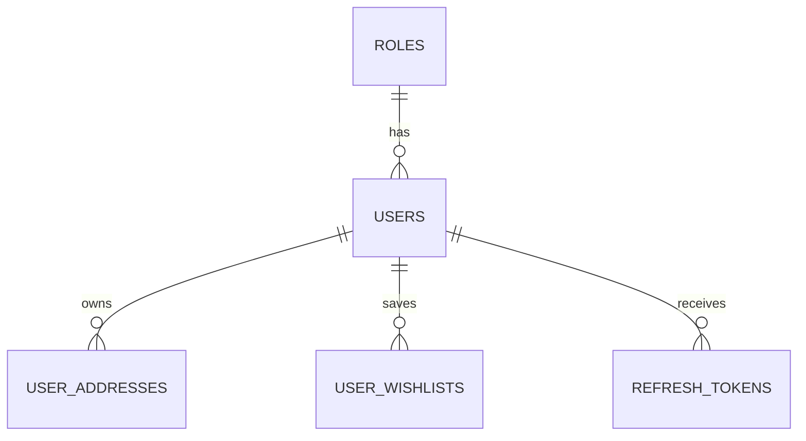
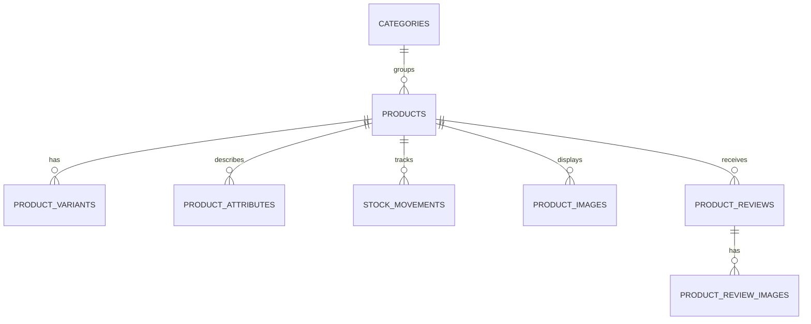
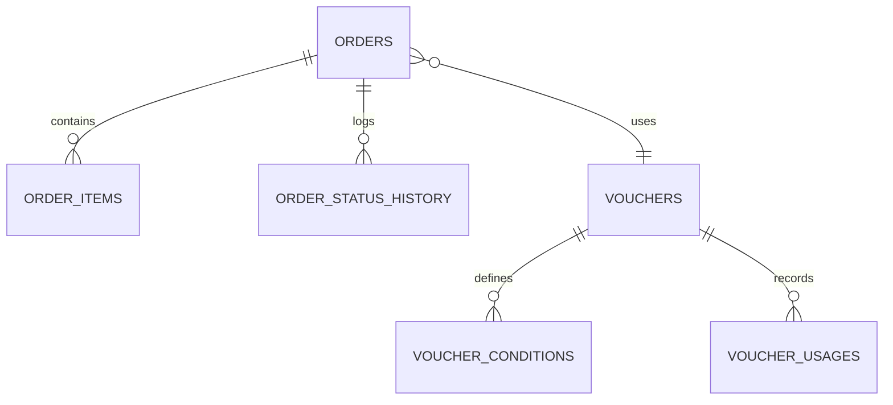
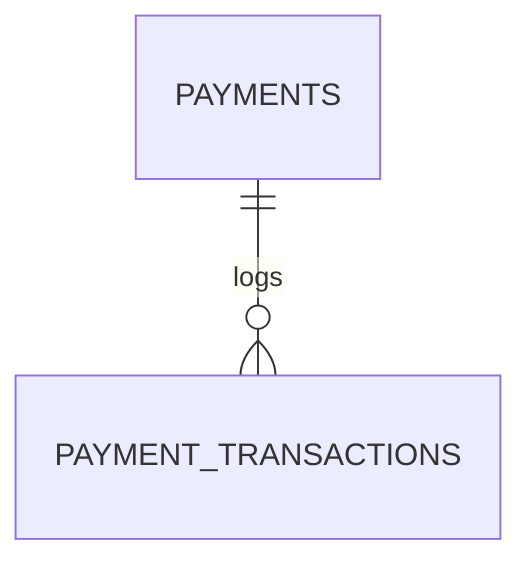

# Hệ thống đặt hàng Microservices (Order System)

Đây là hệ thống đặt hàng trực tuyến được thiết kế theo kiến trúc microservices hướng sự kiện, sử dụng Spring Boot và Spring Cloud ở backend, Next.js ở frontend.

## Các thành phần chính

- `apigateway`: Cổng vào duy nhất, định tuyến request và xử lý JWT.
- `userservice`: Đăng ký, đăng nhập, thông tin người dùng.
- `productservice`: Danh mục sản phẩm và tồn kho.
- `cartservice`: Giỏ hàng, lưu trên Redis.
- `orderservice`: Xử lý đặt hàng.
- `paymentservice`: Thanh toán và webhook SePay.
- `mediaservice`: Module media mới, đã được thêm vào Maven reactor để build cùng backend.
- `commonlib`: DTO, event và thành phần dùng chung.
- `frontend`: Giao diện Next.js.

## Trạng thái hiện tại

- `notificationservice` đã bị loại bỏ khỏi repo.
- `mediaservice` đã có trong Maven modules.
- `mediaservice` chưa được khai báo runtime trong `docker-compose.yml`.

## Công nghệ

- Java 17
- Spring Boot 3.5.0
- Spring Cloud 2025.0.0
- PostgreSQL 15
- Redis 7.2
- Apache Kafka 7.6.0
- React 19
- Next.js 16
- Tailwind CSS v4

## DB Schema

### User Service (`user_db`)



### Product Service (`product_db`)



### Order Service (`order_db`)



### Payment Service (`payment_db`)



### Media Service (`media_db`)

- Bảng `MEDIAS` lưu metadata ảnh upload lên Cloudinary như `url`, `public_id`, `format`, `size_bytes`.
- Không có quan hệ FK nội bộ trong `media_db`.

## Port mặc định trong docker-compose

- `apigateway`: `8080`
- `userservice`: `8081`
- `productservice`: `8082`
- `orderservice`: `8083`
- `paymentservice`: `8084`
- `cartservice`: `8085`
- `frontend`: `3000`
- `postgres`: `5432`
- `redis`: `6380`
- `kafka`: `9092`, `9094`

Lưu ý:

- `mediaservice` hiện chưa có port/runtime trong `docker-compose.yml`.

## Build backend

```bash
mvn clean package -DskipTests
```

Hoặc build riêng `mediaservice` cùng dependency:

```bash
mvn -pl mediaservice -am -DskipTests validate
```

## Chạy bằng Docker Compose

```bash
docker compose up -d
```

PostgreSQL được khởi tạo bằng `init-databases.sql`.

## Chạy frontend local

```bash
cd frontend
npm install
npm run dev
```

Frontend mặc định chạy tại `http://localhost:3000`.
